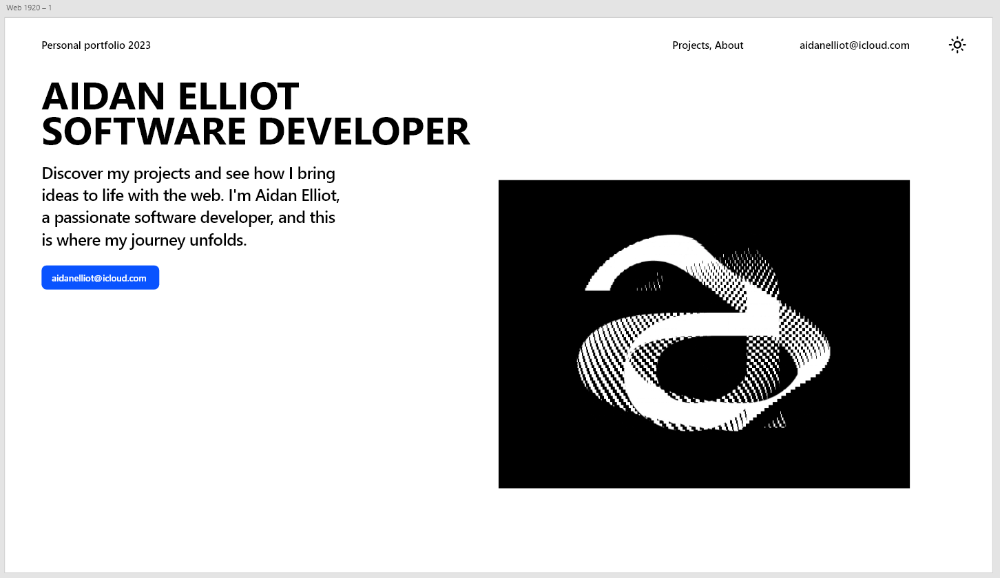

This system design documentation will give a clear overview of the design components used for my personal portfolio project. It will cover the colour palette, typography, components, the layout, and some screenshots of mock-up for visual communication of the design.

## Screenshot

## 1. Colour Palette
For my portfolio. I will be going with a simple light themed white and black page with some small accents of blue. 
- Black - 000000
- White - FFFFFF
- Blue - 0953FF

## 2. Typography
I will be sticking to a clean sans serif font for my portfolio.
- Headers - Segoe UI Bold
- Body text - Segoe UI Semi-bold

## 3. Components and Layout
#### Header Bar
- Different buttons spanning across top of all pages.
	- Title - "Personal Portfolio 2023" links to home page
	- Projects - "Projects" links to projects page
	- About - "About" links to about page
	- Email - "aidanelliot@icloud.com" mailto link to email.
	- Icon to change between light and dark mode.
#### Content
- My name and aspired job as large bold heading.
- Body text with some meaningful homepage copy
- A button that links to my email.
- Animated image asset of the letter "a"
#### Footer
- No footer menu.

### Conclusion
- The portfolio will reflect a minimal and modern feel. It will serve as a reference while implementing the design system of my portfolio. The different web pages will stay consistent in their designs.
