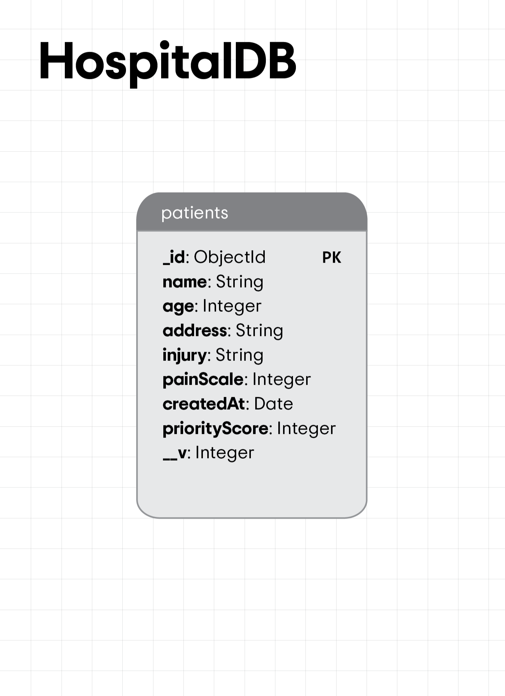

# Emergency Waitlist Database Schema

## 1. Entities Description

### Patients
This entity stores information about patients admitted to the hospital. It includes personal details, injury description, and triage assessment. The priority score is calculated by internal logic in the web application and is stored alongside the patient's record to categorize their priority for treatment.

## 2. Attributes Specification

### Patients
- `_id` (ObjectId): A unique identifier for each patient record. **PRIMARY KEY**
- `name` (String): The name of the patient.
- `age` (Integer): The age of the patient.
- `address` (String): The residential address of the patient.
- `injury` (String): Description of the injury or medical condition.
- `painScale` (Integer): A score representing the patient's pain level, typically on a scale of 1-10. This information is vital for triage and determining the urgency of care.
- `createdAt` (Date): Timestamp indicating when the record was created, useful for tracking admission times and durations of hospital stays.
- `code` (String): A unique code assigned to the patient or the incident. This code can be used for quick reference or for linking with other systems if necessary. **UNIQUE**
- `priorityScore` (Integer): A computed score, generated by the web application, used to categorize the priority of the patient for treatment. It helps in triaging and ensuring that patients receive timely care based on their condition.
- `__v` (Integer): Version key used internally by MongoDB for managing document versions. This field is typically used by Mongoose for optimistic concurrency control.

---

This version of your "db.md" file should now accurately reflect the structure and purpose of your MongoDB database for the Hospital Triage system, focusing solely on the 'Patients' entity. If there are any additional nuances or specific aspects of your database that need to be included, feel free to modify the document accordingly.

## 3. Relationships

There are no relationships defined in the database as it contains only the 'patients' entity. This design is common in NoSQL databases, where inter-entity relationships are not essential. Our focus is solely on patient data, which is self-contained within documents in the 'Patients' collection.

